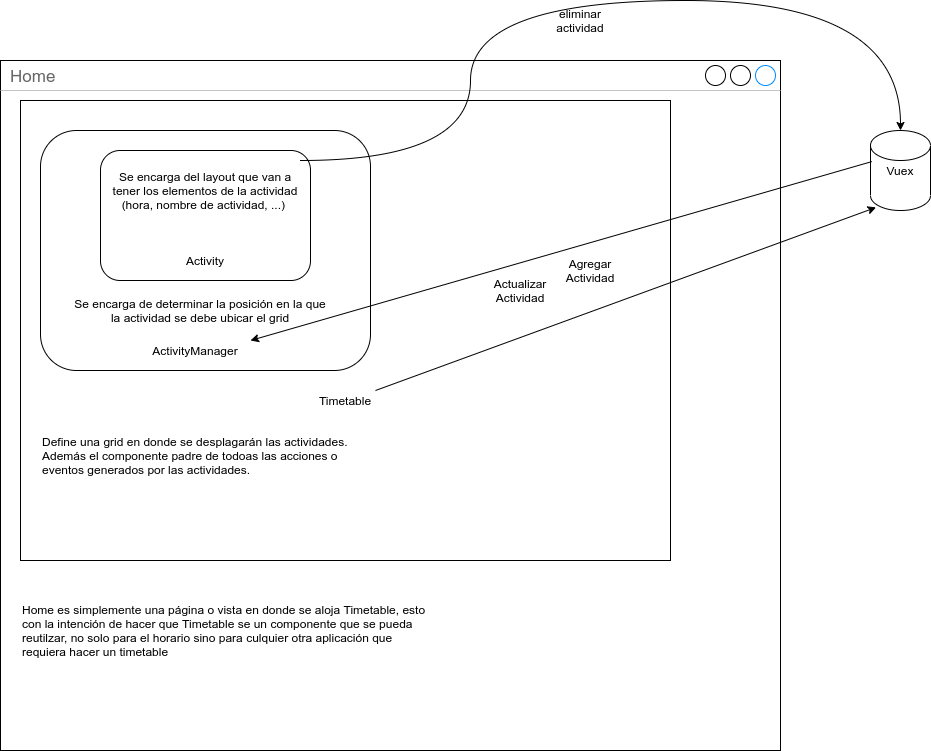

# Schedule

```sh
Septiembre 2020
Vue 2.6.11 | puppeteer 5.2
```


## Fast Docs

En el siguiente bosquejo observamos como interactuan los 3
componentes principales para poder renderizar un "timetable".



## Project setup

```
npm install
```

### Compiles and hot-reloads for development

```
npm run serve
```

### Compiles and minifies for production

```
npm run build
```

### Lints and fixes files

```
npm run lint
```

### Customize configuration

See [Configuration Reference](https://cli.vuejs.org/config/).

### Future features

- Add extra activities: gym, language, ... [PROCESS]
- Fix cell layout: show start and end time
- Change group button
- Print (Download) button
- Take homework notes
  - Scale to a todo list with calendar and more features
- Save zoom Links
- Add sidebar / header
- Share schedules
- Login
- Fork function
- Store schedule in db
- Fork friends schedule
